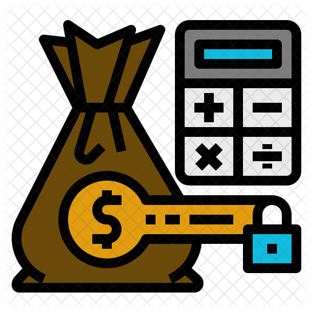

<a name="readme-top"></a>

<div align="center">
  
  <br/>

  <h2><b>Cost Management - CMS</b></h2>
</div>

# 📗 Table of Contents

- [📖 About the Project](#about-project)
  - [🛠 Built With](#built-with)
    - [Tech Stack](#tech-stack)
    - [Key Features](#key-features)
- [💻 Getting Started](#getting-started)
  - [Prerequisites](#prerequisites)
  - [Setup](#setup)
  - [Install](#install)
  - [Usage](#usage)
  - [Run tests](#run-tests)
  - [Deployment](#deployment)
  - [Live Demo](#live-demo)
- [👥 Authors](#authors)
- [🔭 Future Features](#future-features)
- [🤝 Contributing](#contributing)
- [⭐️ Show your support](#support)
- [🙏 Acknowledgements](#acknowledgements)
- [📝 License](#license)

# 📖 Food Recipe <a name="about-project"></a>

**[Cost Management - CMS]** is a Full Stack project. A modern Cost Management web application built with Ruby on Rails. Easily track your expenses, manage categories, and stay on top of your financial goals. Features include user authentication, transaction history, and a responsive design for seamless use on any device.

## 🛠 Built With <a name="built-with"></a>

### Tech Stack <a name="tech-stack"></a>

> The stacks used to build this project are shown below.

<details>
  <summary>Frontend</summary>
  <ul>
    <li><a href="https://developer.mozilla.org/en-US/docs/Web/HTML">HTML</a></li>
    <li><a href="https://rubyonrails.org/">ERB (Embedded Ruby)</a></li>
    <li><a href="https://developer.mozilla.org/en-US/docs/Web/CSS">CSS</a></li>
    <li><a href="https://developer.mozilla.org/en-US/docs/Web/JavaScript">JavaScript</a></li>
    <li><a href="https://tailwindcss.com/">Tailwind CSS</a></li>
  </ul>
</details>
<details>
  <summary>Backend</summary>
  <ul>
    <li><a href="https://rubyonrails.org/">Ruby on Rails</a></li>
  </ul>
</details>
<details>
  <summary>Database</summary>
  <ul>
    <li><a href="https://www.postgresql.org/">PostgreSQL</a></li>
  </ul>
</details>
<details>
  <summary>Authentication</summary>
  <ul>
    <li><a href="https://github.com/heartcombo/devise">Devise</a></li>
  </ul>
</details>
<details>
  <summary>Authorization</summary>
  <ul>
    <li><a href="https://github.com/CanCanCommunity/cancancan">CanCanCan</a></li>
  </ul>
</details>
<details>
  <summary>Deployment</summary>
  <ul>
    <li><a href="https://www.heroku.com/">Heroku</a></li>
  </ul>
</details>
<details>
  <summary>Version Control</summary>
  <ul>
    <li><a href="https://git-scm.com/">Git</a></li>
    <li><a href="https://github.com/">GitHub</a></li>
  </ul>
</details>
<details>
  <summary>Other Tools</summary>
  <ul>
    <li><a href="https://code.visualstudio.com/">Visual Studio Code</a></li>
    <li>Command Line</li>
    <li><a href="https://bundler.io/">Bundler (Ruby gem management)</a></li>
    <li><a href="https://classic.yarnpkg.com/en/">Yarn/NPM (JavaScript package management)</a></li>
  </ul>
</details>

<details>
  <summary>Server</summary>
  <ul>
    <li><a href="https://expressjs.com/">Express.js</a></li>
  </ul>
</details>

<details>
<summary>Database</summary>
  <ul>
    <li><a href="https://www.postgresql.org/">PostgreSQL</a></li>
  </ul>
</details>

### Key Features <a name="key-features"></a>

- **Financial Management**
- **Categories List**
- **Transactions List**
- **User Authentication**

<p align="right">(<a href="#readme-top">back to top</a>)</p>

## 💻 Getting Started <a name="getting-started"></a>

To get a local copy up and running, follow these steps.

### Prerequisites

In order to run this project you need:


Example command:

```sh
 gem install rails
```


### Setup

Clone this repository to your desired folder:


Example commands:

```sh
  cd my-folder
  git clone https://github.com/MoyasiGinko/Cost-Management-Capstone.git
```

### Install

Install this project with:


Example command:

```sh
  cd my-project
  gem install bundler
  bundle install
  npm install
```

### Usage

To run the project, execute the following command:


Example command:

```sh
  rails server
```

### Run tests

To run tests, run the following command:


Example command:

```sh
  rspec spec/
```


### Deployment
> To deploy this project on Heroku, follow these steps:

1. Create a Render account and create a new web service.
2. Connect your GitHub account to Render.
3. Select the repository you want to deploy.
4. Render will automatically detect that this is a Ruby on Rails project and will build it accordingly.
5. Click on "Create Web Service" and wait for the build to finish.
6. Once the build is finished, click on "Open App" to see your live application.

You can try other deployment platforms like [Heroku](https://www.heroku.com/) or [Netlify](https://www.netlify.com/).
### Live Demo <a name="live-demo"></a>

[Live Demo Link](https://rails-8sbg.onrender.com/)

[Presentation Video](https://www.loom.com/share/90bf801fe7134f3c91696308f2e89a48?sid=6c0f3195-18e7-4ef6-9704-d4019104719f)

<p align="right">(<a href="#readme-top">back to top</a>)</p>


## 👥 Authors <a name="authors"></a>

👤 **Moyasi**

- GitHub: [MoyasiGinko](https://github.com/MoyasiGinko)
- Twitter: [moyasi_ginko](https://twitter.com/moyasi_ginko)
- LinkedIn: [moyasi](https://www.linkedin.com/in/moyasi)

<p align="right">(<a href="#readme-top">back to top</a>)</p>

## 🔭 Future Features <a name="future-features"></a>

- [ ] **User Profiles and Authentication**
- [ ] **User photos**
- [ ] **Advanced Search and Filters**
- [ ] **More details to categories and transactions**

<p align="right">(<a href="#readme-top">back to top</a>)</p>

## 🤝 Contributing <a name="contributing"></a>

Contributions, issues, and feature requests are welcome!

Feel free to check the [issues page](https://github.com/MoyasiGinko/Cost-Management-Capstone/issues)

<p align="right">(<a href="#readme-top">back to top</a>)</p>

## ⭐️ Show your support <a name="support"></a>

If you like this project, don't forget to give it a star on GitHub! Your support helps us to continue improving the app.


<p align="right">(<a href="#readme-top">back to top</a>)</p>

## 🙏 Acknowledgments <a name="acknowledgements"></a>

At first, I would like to thank Microverse for providing such amaizng documentation. I would like to thank our Microverse community for their support and encouragement.

<p align="right">(<a href="#readme-top">back to top</a>)</p>


## 📝 License <a name="license"></a>

This project is [MIT](./LICENSE) licensed.

<p align="right">(<a href="#readme-top">back to top</a>)</p>